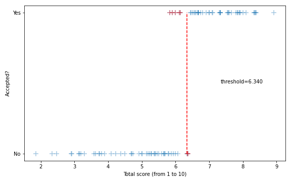

# Crowd-sourcing raw scores for your COSYNE reviewer feedback

Following that message:

> Dear community, 

> COSYNE is a great conference which plays a pivotal role in our field. If you have submitted an abstract (or several) you have recently received your scores. I am not affiliated to COSYNE - yet willing to contribute in some way: I would like to ask one minute of your time to report the raw scores from your reviewers. I will summarize in a few lines the results in one week time (11/02). The more numerous your feedbacks the better their precision!

> Thanks!

I have received $N = 82$ anwsers from the [google form](https://forms.gle/hjzWVemM4Jy9cBbZ9) (out of them, $79$ are valid) out of the $881$ submitted_abstracts. This allows us to make some analysis of the score... Here are the results.

In short, the total score is the sum of the scores relatively weighted by the confidence levels and the threshold is close to $6$:

More details in the [notebook](https://github.com/laurentperrinet/2022-02-11_COSYNE-scoresheet/blob/main/2022-02-11_COSYNE-scoresheet.ipynb) which can also be forked and [interactively modified on binder](https://mybinder.org/v2/gh/laurentperrinet/2022-02-11_COSYNE-scoresheet/main?labpath=2022-02-11_COSYNE-scoresheet.ipynb).
